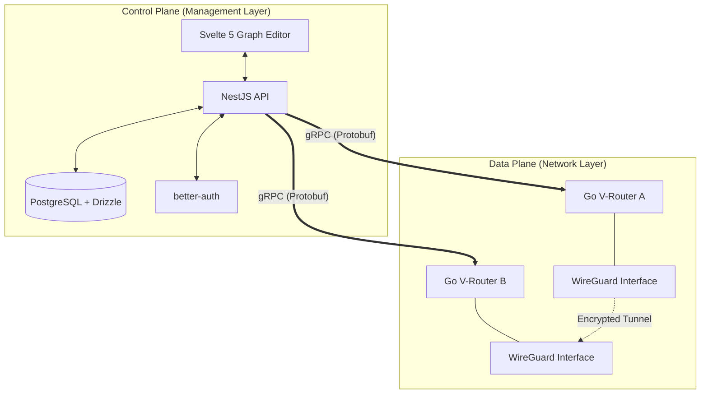

# System Architecture - VirtualNetworks

This document provides a deep dive into the technical design, data flows, and component interactions of the VirtualNetworks platform.

## High-Level Overview

VirtualNetworks is built as a **Distributed Control Plane** system. It separates the orchestration logic (Control Plane) from the actual packet forwarding (Data Plane).



---

## 1. Control Plane (Backend)

The Control Plane is the "brain" of the network. It maintains the global state and ensures all routers are in sync.

### Data Model
Managed via **Drizzle ORM**, the schema includes:
- **Networks**: Logical L3 segments (CIDRs).
- **Devices**: Endpoints (Servers, Laptops, Gateways) with WireGuard public keys.
- **Protocol Instances**: Specific VPN listeners (e.g., a WireGuard server on port 51820).
- **Peers**: Relationships between devices within a network.
- **Tags**: Metadata for grouping devices and applying ACL rules.

### Configuration Lifecycle
1.  **Intent**: An admin changes the topology in the Web UI.
2.  **Validation**: NestJS validates the change against existing CIDRs and rules.
3.  **Persistence**: The new state is saved to PostgreSQL.
4.  **Distribution**: The Control Plane identifies affected Routers and pushes updates via gRPC streams (`WatchRouterConfiguration`).

---

## 2. V-Router (Data Plane)

The V-Router is a lightweight Go application running on the network edge.

### Core Responsibilities
- **WireGuard Management**: Uses `wireguard-go` (userspace) to create and manage tunnels without needing kernel-level changes on the host.
- **Dynamic Routing**: Manages system routing tables to direct traffic into specific tunnels.
- **Security (nftables)**: Implements ZTNA by dynamically generating and applying firewall rules.
- **Health Reporting**: Streams handshakes and traffic metrics back to the Control Plane.

### Networking Stack
- **Incoming**: Listens for gRPC instructions.
- **Outgoing**: Connects to the Control Plane (Inbound-free architecture).
- **Processing**: Packets are filtered via `nftables` before being encapsulated into WireGuard UDP packets.

---

## 3. Communication Protocol (gRPC)

We use gRPC with Protobuf for all internal communications to ensure type safety and high performance.

### Key RPC Services
- **`WatchRouterConfiguration`**: A server-side streaming RPC. Routers keep this open to receive "Live Updates". When a new peer is added globally, the affected router receives a `RouterConfigurationUpdate` immediately.
- **`ReportRouterEvents`**: A client-side streaming RPC. Routers push handshake logs, Rx/Tx bytes, and connection states to the backend for real-time dashboard updates.

---

## 4. Web Dashboard (Frontend)

The frontend is a reactive Svelte 5 application focused on visualization.

### Graph-Based Editor
Instead of lists, the network is managed as a visual graph:
- **Nodes**: Routers, Gateways, and End-devices.
- **Edges**: Peer-to-peer tunnels or subnet routes.
- **State**: Uses Svelte's runes (`$state`, `$derived`) for high-performance UI updates of thousands of nodes.

---

## 5. Security Model (Zero Trust)

VirtualNetworks follows the **ZTNA (Zero Trust Network Access)** model:
1.  **Identity-First**: Access is granted based on device/user identity, not IP location.
2.  **Micro-segmentation**: By default, no device can talk to another. Rules must be explicitly defined (e.g., `Tag:Frontend` can talk to `Tag:API` on port 443).
3.  **Invisible Perimeter**: Routers do not listen for management connections. They "dial out" to the controller, making them invisible to external port scanners.

---

## 6. Directory Structure
```text
├── proto/              # Protobuf definitions (the "Source of Truth")
├── backend/            # NestJS implementation of the Control Plane
├── router/             # Go implementation of the Data Plane
├── frontend/           # Svelte 5 dashboard
└── common/             # Shared TypeScript logic and types
```
