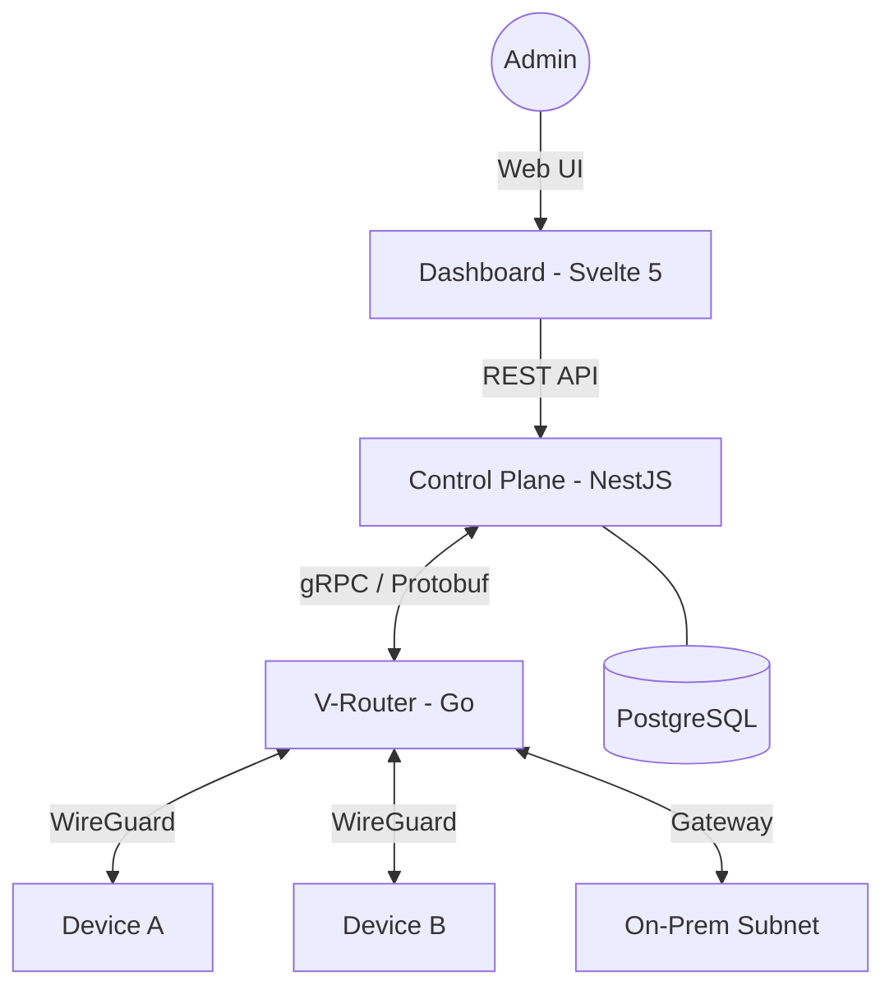

<h1 align="center">
  <br>
    Qnlink
  <br>
</h1>

<h4 align="center">Modern Zero Trust Network Access (ZTNA) Platform for Invisible Infrastructure</h4>

<p align="center">
  <a href="https://img.shields.io/badge/Status-Active-green.svg">
    
  </a>
  <a href="https://img.shields.io/badge/Protocol-WireGuard-orange.svg">
    
  </a>
  <a href="https://img.shields.io/badge/Architecture-Distributed-blue.svg">
    
  </a>
</p>

<p align="center">
  <a href="#purpose">Purpose</a> •
  <a href="#key-features">Features</a> •
  <a href="#architecture">Architecture</a> •
  <a href="#tech-stack">Tech Stack</a> •
  <a href="#quick-start">Quick Start</a> •
  <a href="#development">Development</a>
</p>

## Purpose

**Qnlink** is a comprehensive software-defined networking platform designed to eliminate the risks and complexities of traditional VPNs. Built on **Zero Trust** principles, it makes your protected infrastructure "invisible" to external threats by moving routing and access control to a managed control plane.

Designed for system engineers and IT administrators, Qnlink provides a powerful **graph-based web editor** to manage your entire network topology visually, replacing cryptic configuration files with an intuitive and transparent interface.

## Key Features

- **🛡️ Zero Trust Architecture**: Implicit deny by default. Every connection is strictly authenticated and authorized at the micro-service level.
- **🗺️ Graph-Based Topology Editor**: Design and manage your network visually. See exactly how traffic flows and which devices are connected.
- **🕶️ Invisible Infrastructure**: No open ports within your perimeter. Routers connect outbound to the Control Plane, making them resilient to port scanning and external exploits.
- **📜-as-Code Configuration**: Support for declarative configurations (YAML/JSON/DSL). Version your network infrastructure and integrate it into CI/CD pipelines.
- **🚀 Distributed Userspace Routers**: High-performance Go-based routers implementing WireGuard in userspace for maximum portability and automatic scaling.
- **📊 Real-time Observability**: Built-in monitoring for handshakes, traffic volume, and connection states without extra tools.

## Architecture

Qnlink uses a distributed architecture where the intelligence is centered in the **Control Plane**, while the traffic is handled by independent **V-Routers**. For a more in-depth look, see the [Architecture Documentation](ARCHITECTURE.md).



### Components
1.  **Control Plane (Backend)**: Built with NestJS 11. Orchestrates the network, manages identities via `better-auth`, and pushes configurations to routers.
2.  **Dashboard (Frontend)**: A modern Svelte 5 application providing a graph-based editor and real-time network monitoring.
3.  **V-Router (Router)**: A userspace Go application. It handles WireGuard connections and applies firewall rules (nftables) dynamically based on instructions from the Control Plane.
4.  **Protobuf/gRPC**: The high-performance communication backbone that keeps all components in sync.

## Tech Stack

| Component | technologies |
| :--- | :--- |
| **Frontend** | Svelte 5, SvelteKit 2, Tailwind CSS 4, Bits UI, TanStack Table |
| **Backend** | NestJS 11, Drizzle ORM, PostgreSQL, better-auth |
| **Router** | Go, Userspace WireGuard, Linux nftables |
| **Common** | Protobuf (gRPC), TypeScript DTOs |
| **Tooling** | pnpm, Biome, Docker, TurboRepo |

## Quick Start

### Prerequisites
- [Docker](https://www.docker.com/) and [Docker Compose](https://docs.docker.com/compose/)
- [Node.js](https://nodejs.org/) (for local development)
- [pnpm](https://pnpm.io/)

### Running with Docker Compose
The easiest way to get started is using the provided `docker-compose.yaml`:

```bash
# Clone the repository
git clone https://github.com/arizona-bebras/virtual-networks.git
cd virtual-networks

# Start the services
docker compose up -d
```
The dashboard will be available at `http://localhost:5173` (by default) and the Control Plane at `http://localhost:3000`.

## Development

This project is organized as a **pnpm monorepo**.

### Repository Structure
- `frontend/`: Web Dashboard source code.
- `backend/`: API and Control Plane logic.
- `router/`: Go-based WireGuard router.
- `proto/`: Shared Protobuf definitions and generated code.
- `common/`: Shared TypeScript DTOs used by frontend and backend.

### Useful Commands
```bash
# Install dependencies
pnpm install

# Check and lint code (Biome)
pnpm run check

# Build the entire project
pnpm run build

# Run backend development mode
cd backend && pnpm run start:dev
```

## Roadmap

- [ ] **Advanced ACL with Tags**: Fine-grained access control between device groups.
- [ ] **VPN-scoped DNS**: Automatic hostname resolution within virtual networks.
- [ ] **On-Premise Gateways**: Securely connect entire offices or clusters.
- [ ] **Automated Scaling**: Cloud routers that scale based on traffic load.
- [ ] **Audit Log**: Full history of configuration changes and access events.

---
🇷🇺
